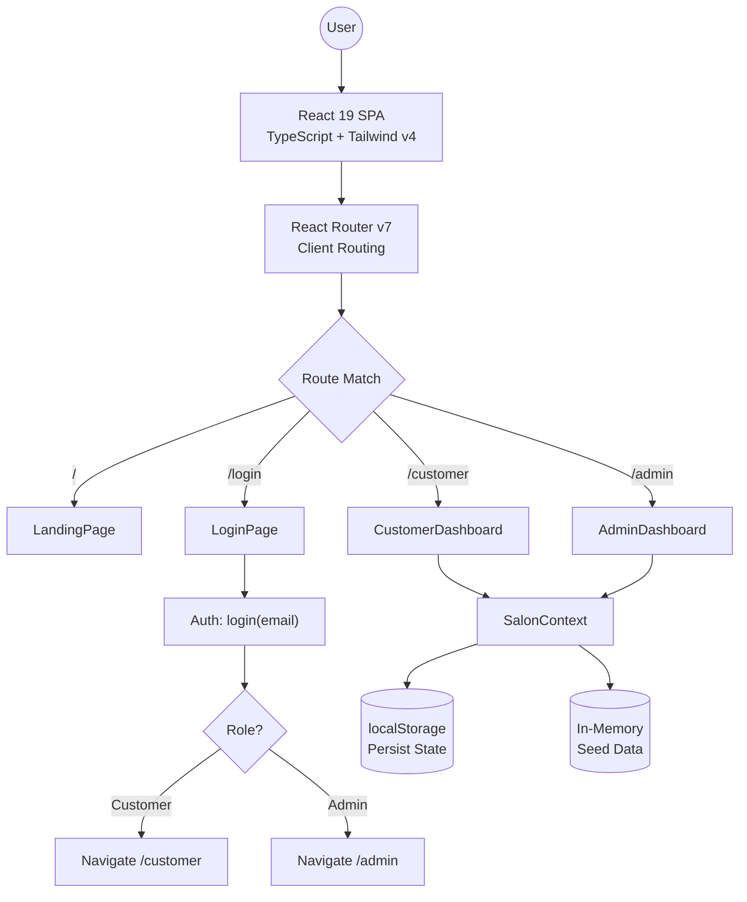
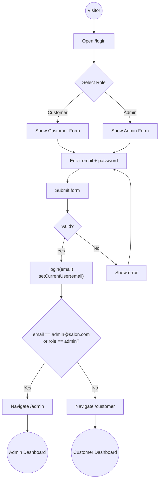
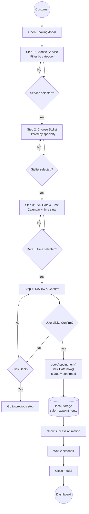
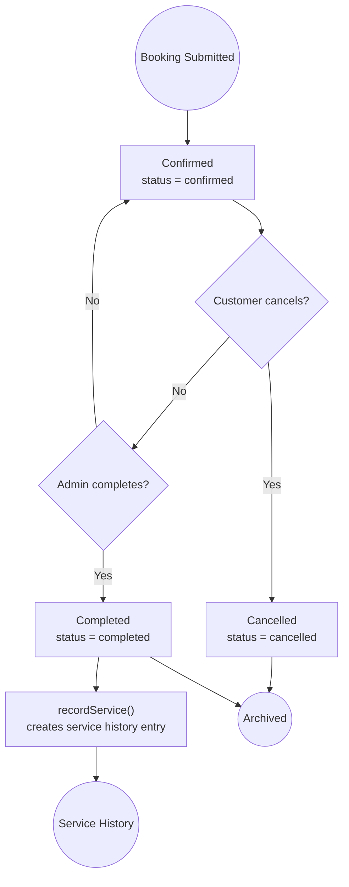
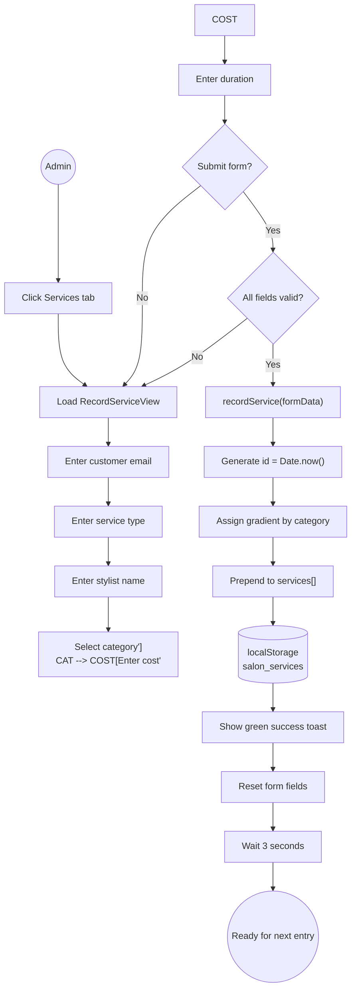
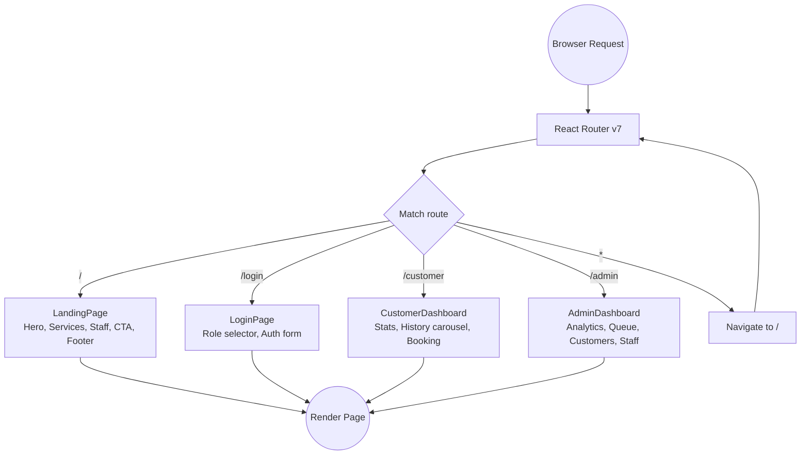

# Salon CRM

A premium salon CRM with customer booking, admin dashboard, analytics, and staff management -- built with React 19, TypeScript, Tailwind CSS v4, and Vite.

## Features

- **Landing Page** -- Hero stats, services grid with category filter, testimonials, staff directory
- **Customer Dashboard** -- Stats cards, service history carousel with drag/swipe, upcoming appointments, booking modal (4-step flow)
- **Admin Dashboard** -- Revenue chart, customer database with search, appointment queue with complete/cancel, service recording, staff directory
- **Authentication** -- Role selector (Customer/Admin), demo credentials hint
- **Responsive** -- Full mobile support with glassmorphism UI

## Stack

- React 19 + TypeScript
- Vite 8 + SWC
- Tailwind CSS v4 (`@tailwindcss/vite`) + `tw-animate-css`
- Framer Motion
- Lucide React icons
- React Router v7

## Getting Started

```bash
npm install
npm run dev
```

Open http://localhost:5173 in your browser.

### Demo Accounts

| Role     | Email                  | Password   |
|----------|------------------------|------------|
| Customer | customer@example.com   | any        |
| Admin    | admin@salon.com        | any        |

## Scripts

| Command           | Description            |
|-------------------|------------------------|
| `npm run dev`     | Start dev server       |
| `npm run build`   | Production build       |
| `npm run preview` | Preview production     |
| `npm run lint`    | Run ESLint             |
| `tsc --noEmit`    | TypeScript check       |

## System Architecture

### System Flowchart (Production Target)



### Authentication Flowchart



### Booking Process Flowchart



### Appointment Lifecycle Flowchart



### Service Recording Flowchart (Admin)



### Routing Flowchart



## Project Structure

```
src/
├── components/     # Shared components (Navbar, Footer, ServiceCard, etc.)
├── context/        # React context (SalonContext)
├── pages/          # Route pages (LandingPage, Login, CustomerDashboard, AdminDashboard)
├── types/          # TypeScript interfaces
└── vite-env.d.ts   # Vite type declarations
```
