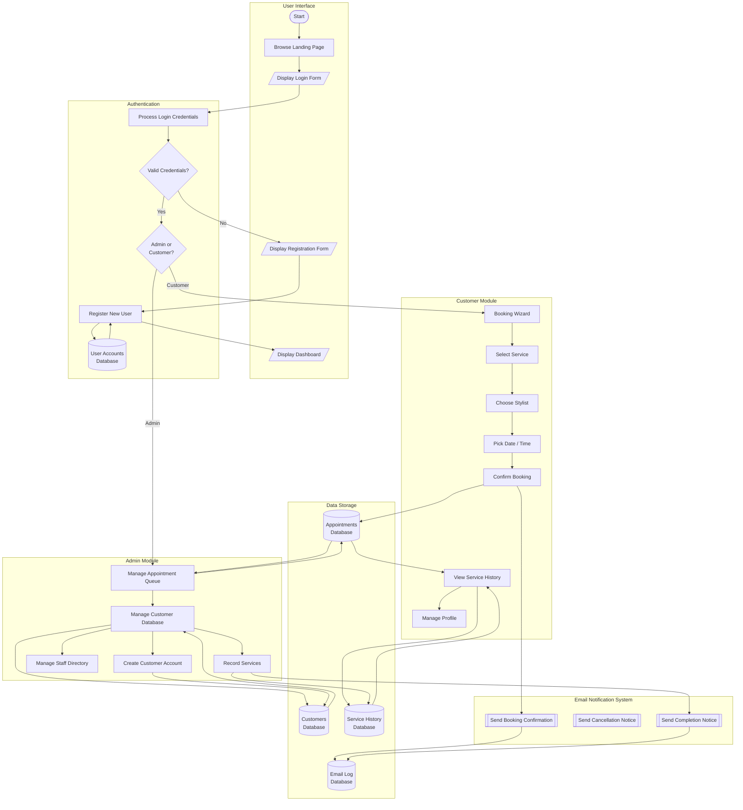
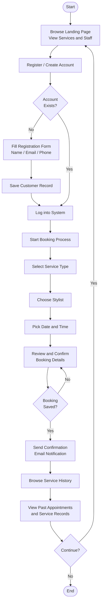

# Salon CRM

A salon CRM focused on scheduling, automated email notifications, and service history tracking -- built with React 19, TypeScript, Tailwind CSS v4, and Vite.

## Features

- **Landing Page** -- Services grid with category filter, staff directory, testimonials
- **Customer Dashboard** -- Service history timeline, upcoming appointments, booking wizard, email notification log
- **Admin Dashboard** -- Appointment queue with complete/cancel, customer database, service recording, staff directory, email notification feed
- **Authentication** -- Role selector (Customer/Admin), self-registration, demo credentials
- **Automated Email Reachout** -- Email notifications sent on booking, cancellation, completion, and reminders
- **Service History** -- Timeline-style history view with category filters, expandable details
- **Account Creation** -- Self-registration from website or admin-panel creation
- **Responsive** -- Full mobile support with glassmorphism UI

## Stack

- React 19 + TypeScript
- Vite 8 + SWC
- Tailwind CSS v4 (`@tailwindcss/vite`) + `tw-animate-css`
- Framer Motion
- Lucide React icons
- React Router v7

## Getting Started

```bash
npm install
npm run dev
```

Open http://localhost:5173 in your browser.

### Demo Accounts

| Role     | Email                  | Password   |
|----------|------------------------|------------|
| Customer | customer@example.com   | any        |
| Admin    | admin@salon.com        | any        |

## Scripts

| Command           | Description            |
|-------------------|------------------------|
| `npm run dev`     | Start dev server       |
| `npm run build`   | Production build       |
| `npm run preview` | Preview production     |
| `npm run lint`    | Run ESLint             |
| `tsc --noEmit`    | TypeScript check       |

## System Flowchart

The system flowchart illustrates the overall architecture of the Salon CRM — showing how users, processes, system modules, databases, and outputs interact to deliver scheduling, email notifications, and service history tracking. The system supports two account creation paths: website self-registration and admin-panel creation.



## Process Flowchart

The process flowchart documents the step-by-step sequence of user tasks within the Salon CRM -- from browsing services through registration, booking, and history review.



## Project Structure

```
src/
├── components/     # Shared components (Navbar, Footer, ServiceCard, etc.)
├── context/        # React context (SalonContext)
├── pages/          # Route pages (LandingPage, Login, CustomerDashboard, AdminDashboard)
├── types/          # TypeScript interfaces
└── vite-env.d.ts   # Vite type declarations
```
